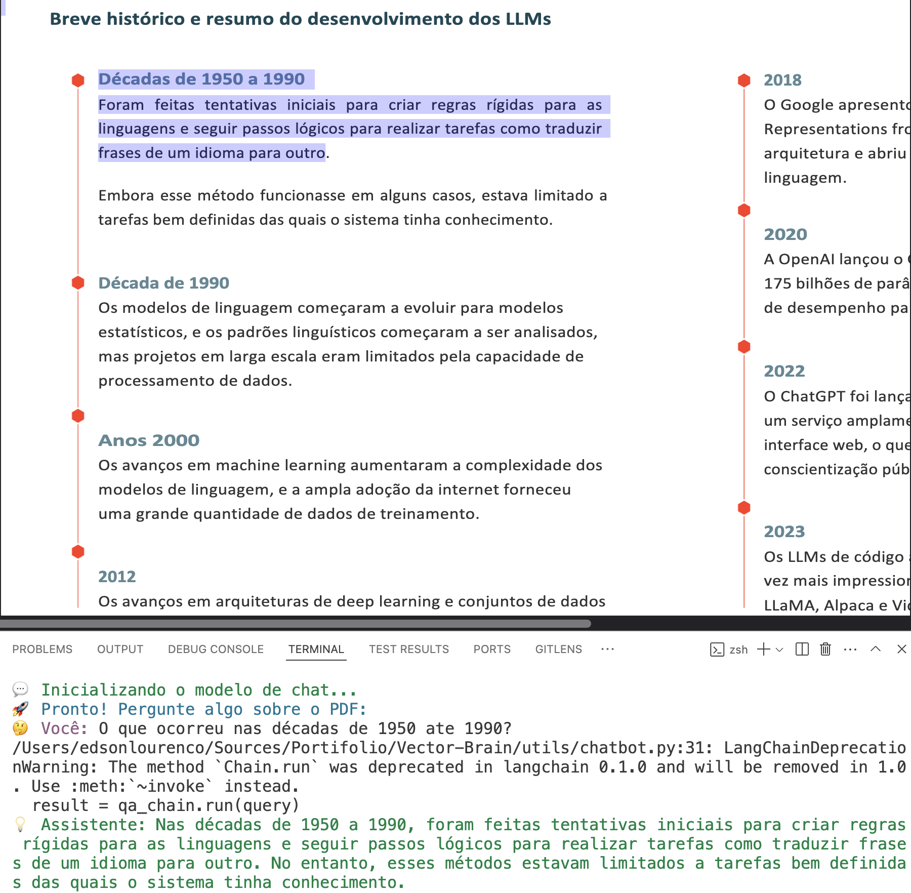
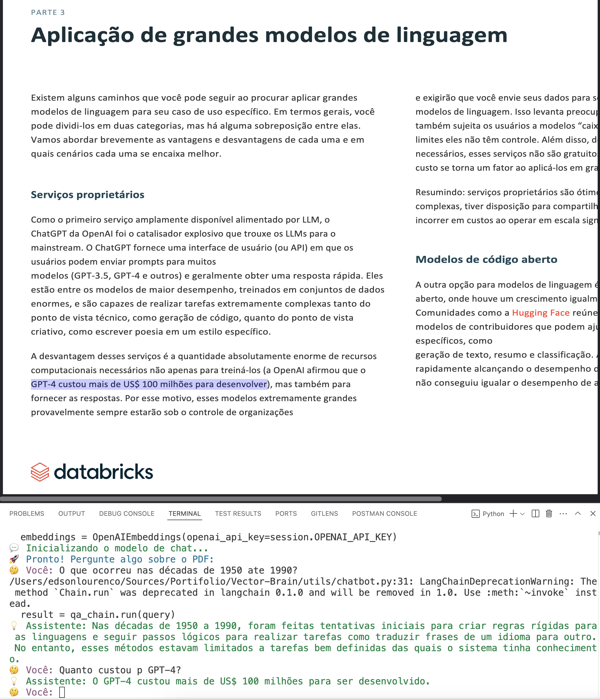
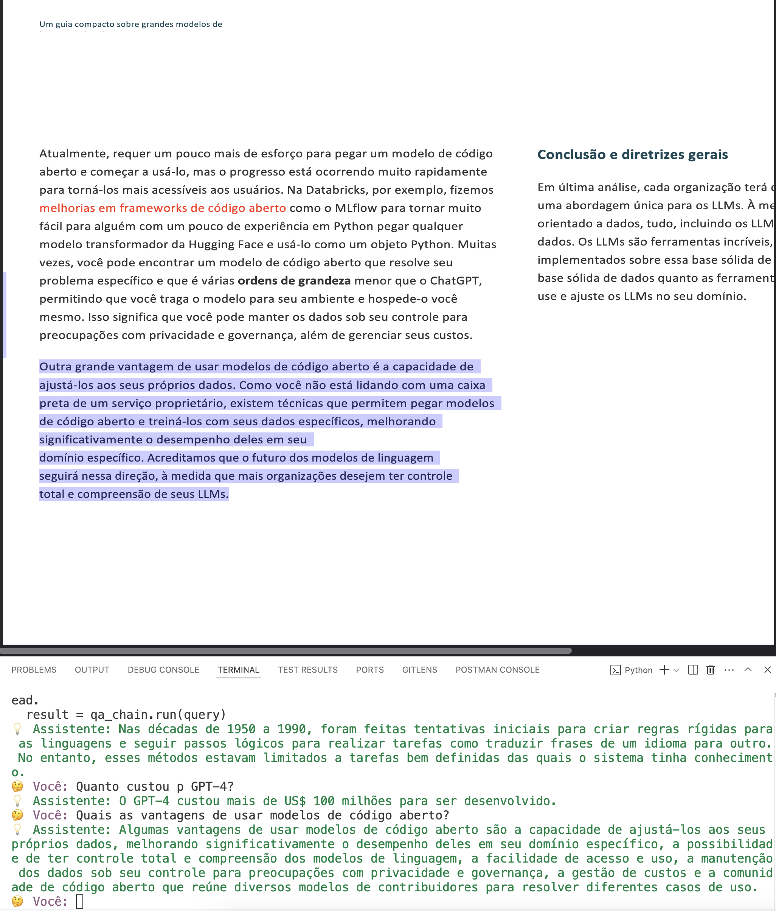

# 🤖 Vector Brain - LLM Chatbot with PDF Vectorization

Welcome to **Vector Brain**! This project showcases how to build an intelligent chatbot using LLMs and PDF document vectorization. The goal is to enable contextual Q&A over a technical e-book using state-of-the-art AI.

## 📚 Document Used

The vectorized PDF is the official free Databricks e-book (PT-BR version):  
[TAP FULL POTENTIAL LLM - Databricks](https://www.databricks.com/br/resources/ebook/tap-full-potential-llm?scid=7018Y000001Fi0cQAC&utm_medium=paid+search&utm_source=google&utm_campaign=20613856692&utm_adgroup=160163579880&utm_content=ebook&utm_offer=tap-full-potential-llm&utm_ad=687639151367&utm_term=modelos%20de%20linguagem%20grandes&gad_source=1&gad_campaignid=20613856692&gbraid=0AAAAABYBeAhja7JrujV1Gwa5wnSWhEQ2J&gclid=CjwKCAjw6ZTCBhBOEiwAqfwJd83xaDMopGbPakJcHmZJqEObU3PSfAa0nQU2TmdQ7HKLvOhngvWF-RoC_5IQAvD_BwE)

## ✨ Demo

Check out some scenes of the project in action:


> **Scene 1:** Chatbot initialization and loading of the vectorized PDF document.


> **Scene 2:** User asks a question about the e-book content and receives a contextualized answer.


> **Scene 3:** Demonstration of chat session ending with a friendly message.

## 🚀 How to Use

Follow these steps to run the project locally:

1. **Clone the repository**
   ```bash
   git clone https://github.com/your-username/Vector-Brain.git
   cd Vector-Brain
   ```

2. **Create and activate a virtual environment**
   ```bash
   python3 -m venv .venv
   source .venv/bin/activate  # Linux/Mac
   .venv\Scripts\activate     # Windows
   ```

3. **Install dependencies**
   ```bash
   pip install -r requirements.txt
   ```

4. **Set up your OpenAI key**
   - Create a `.env` file in the project root with:
     ```
     OPENAI_API_KEY=your-openai-key-here
     ```

5. **Run the application**
   ```bash
   python main.py
   ```

6. **Chat with the bot**
   - Ask questions about the e-book content directly in the terminal.
   - To exit, type `sair`, `exit`, or `quit`.

## 🧪 How to Test

Run all automated tests with:
```bash
pytest
```

## 🛠️ Project Structure

- `utils/` — Utility modules (chatbot, database, settings)
- `tests/` — Automated tests
- `docs/` — PDF
- `static/demo/` — Demo images

## 🤝 Contributing

Feel free to open issues or pull requests!

---

Made with 💙 by Edson Lourenço
